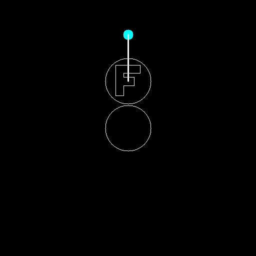
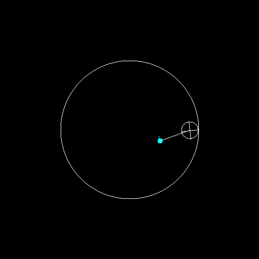

<html lang="ja">
    <head>
        <meta charset="utf-8" />
    </head>
    <body>
        <h1>
Trochoid
</h1>
        <h2>なにものか？</h2>
        

            トロコイド(trochoid)を表示するだけのプログラムです。 
            <table border="1">
                <tr><th>用語</th><th>説明</th></tr>
                <tr><td>トロコイド(trochoid)</td><td>円をある軌道に沿ってすべらないように転がしたとき、その円の内部または外部の定点が描く曲線</td></tr>
                <tr><td>サイクロイド(cycloid)</td><td>軌道が直線、定点が円周上の場合のトロコイド</td></tr>
                <tr><td>カーディオイド(cardioid)</td><td>軌道が円、定点が円周上の場合のトロコイド</td></tr>
            </table>
            <h3>軌道が直線</h3>
            <h4>定点が円の外部</h4>
             
            <h4>定点が円周上：cycloid</h4>
             
            <h4>定点が円の内部</h4>
             
            <h3>軌道が円:円の外を転がる(epitrochoid))</h3>
            <h4>定点が円の外部</h4>
             
            <h4>定点が円周上：cardioid</h4>
             
            <h4>定点が円周上：cardioid。円の半径比 4 vs 5</h4>
            層が4段、葉っぱが5枚になる 
             
            <h4>定点が円の内部</h4>
             
            <h3>軌道が円:円の中を転がる(intratrochoid, spirograph)</h3>
             
        

        <h2>環境構築方法</h2>
        

            pip install opencv-python 
        

        <h2>使い方</h2>
        <h3>軌道が直線</h3>
        

            python trochoid.py [(回転円の半径に対する定点の倍率)] 
        

        <h3>軌道が円：円の外部を転がる</h3>
        

            python epitrochoid.py [(回転円の半径に対する定点の倍率) (回転円の半径) (固定円の半径)] 
        

        <h3>軌道が円：円の内部を転がる(spirograph)</h3>
        

            python intratrochoid.py 
        

        <h3>おまけ：サイクロイドを円周に貼り付けるとカーディオイドになる</h3>
        

            python cycloid_cardioid.py 
            軌道に沿った円の回転(1回転) ＋ 軌道の回転(1回転) ＝ 2回転 
        

             
        <h3>おまけ：定点が円の外、直線軌道のトロコイドを丸い軌道に貼り付けるとNTTロゴが出来上がる</h3>
        

            python ntt.py 
        

             
    </body>
</html>
